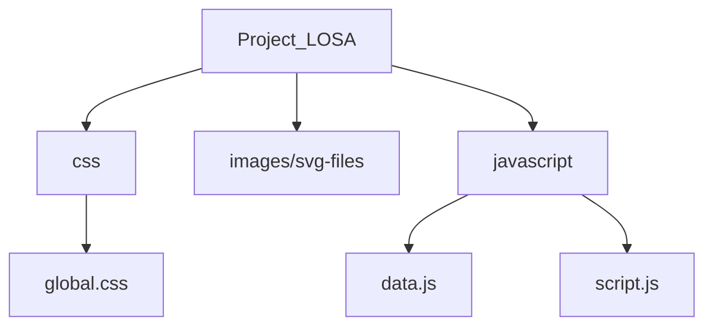

# project-losa
Project LOSA is a Project aimed at getting entry level and experienced programmers involved in contributing their knowledge for beginners to learn. This knowledge will be shared on the LOSA platform with free access to the public.

# Folder Structure (edit if it changes)

### Project_LOSA/css
- This is where css styling files are stored.

### Project_LOSA/images/svg-files
- This is where all image-type files are stored.

### Project_LOSA/javascript
- Files:
  - data.js : (supposed to) contains all the static data about the lessons.
  - script.js : contains the javascript code that controls the html doc
